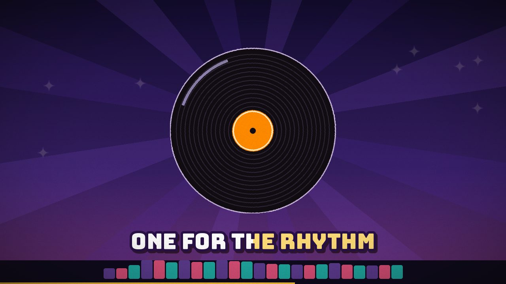
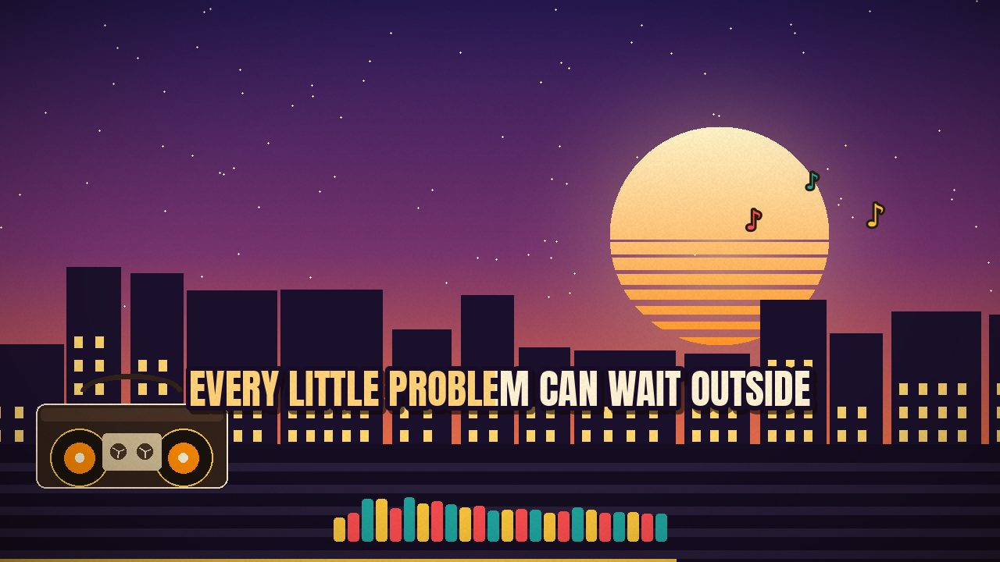

# Let It Ride — Music Video Generator

electron6「Let It Ride」(Suno制作) のミュージックビデオを、コードだけで自動生成するパイプラインです。
70年代ファンク/オールドスクール・ヒップホップの「夏のブロックパーティ」をテーマに、
曲の構造に合わせてシーンが展開します。

| タイトル | コーラス |
|---|---|
|  |  |

| ブレイクダウン | Verse 3(夕暮れ) |
|---|---|
|  |  |

## 仕組み

1. **analyze.py** — ffmpeg でデコードし、numpy だけで STFT 解析。
   オンセット包絡線 → テンポ推定(99.4 BPM)→ 動的計画法によるビートトラッキング、
   帯域別エネルギー(ベース/中域/高域)、24バンドスペクトラム、
   自己相似行列によるセクション境界検出(novelty curve)を `analysis.npz` に保存。
   併せてセンター成分抽出でボーカル寄りの `vocals16k.wav` を生成。
2. **revocal.py** — アライメント用にマイルドなボーカル抽出を再生成(任意)。
3. **align.py** — MP3 の ID3 タグに埋め込まれた歌詞全文を、pocketsphinx の
   強制アライメント(set_align_text)で音声に整列し、**589語すべての単語タイミング**を取得。
4. **build_timeline.py** — 単語タイミングから行・セクションのタイムラインを構築。
   間奏をまたいで引き伸ばされた行はクラスタ補正。セクション開始はダウンビートにスナップ。
5. **render.py** — 1280×720/30fps のフレームを PIL+numpy で描画し、ffmpeg にパイプして
   元の MP3 と多重化。

### 音に反応する要素

- ビート/小節頭で全体がパルス(空の明度、文字のバウンス、カメラボブ)
- ラジカセのスピーカーコーンはベース帯域で振動
- 夜景の窓明かりとEQバーは24バンドスペクトラムに追従
- 歌詞は単語単位のカラオケハイライト、コーラスの「LET IT RIDE」は文字が波打つ
- 強いオンセットで色収差キック、紙吹雪はビートごとに発射(最終コーラス)

### シーン構成(曲構造に自動追従)

Intro=タイトルカード → Verse=街とラジカセ → Chorus=太陽光線とダンサー →
Breakdown=夜のレコード盤 → Verse 3=夕暮れ→夜景 → Final Chorus=紙吹雪 → Outro=夜空+エンドカード

## 再現方法

```bash
pip install numpy pillow imageio-ffmpeg pocketsphinx fonttools brotli
cd music-video
export MV_AUDIO=/path/to/Let_It_Ride.mp3   # 省略時は music-video/Let_It_Ride.mp3
python3 analyze.py
python3 revocal.py
python3 align.py
python3 build_timeline.py
python3 render.py            # → let_it_ride_mv.mp4(約6分)
python3 render.py --png 2070 # 単一フレームのプレビュー
python3 render.py --no-lyrics --out visualizer.mp4  # 歌詞なし(ビジュアライザー)版
python3 render_tiktok.py     # → let_it_ride_tiktok.mp4(TikTok用 30秒 1080×1920 縦型)
```

`render_tiktok.py` はヴァース終盤〜コーラス(57.9〜88.0秒、ダウンビートにスナップ)を切り出し、
縦型レイアウト(UIセーフゾーン考慮)+エンドカード付きで書き出します。

- `meta.txt` は `ffmpeg -i song.mp3 -f ffmetadata meta.txt` で生成(歌詞入りID3タグ)。
- 音符・スパークル記号に DejaVu Sans(Linux 標準)を使用。パスは環境に合わせて調整してください。

## fonts/

Anton・Archivo Black・Bungee(いずれも SIL Open Font License 1.1、Google Fonts /
[Fontsource](https://fontsource.org/) 配布物から変換)。ライセンス条項に基づき同梱しています。
